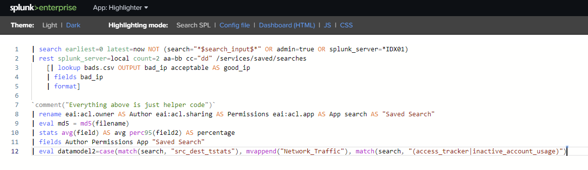
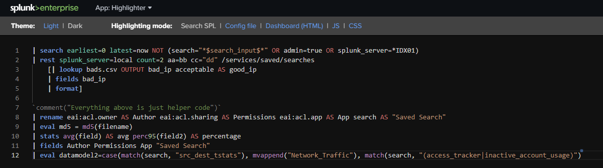

# Highlighter

This app allows you to do syntax highlighting of SPL queries, .conf files, dashboards other web components.
The strength is that you can "copy" the highlighted text and paste it in word documents or emails and the 
syntax highlighting will be preserved. Perfect for sharing queries that users can understand more easily.

A companion website is also being created and will be available soon.

Copyright (C) 2018 Chris Younger
I am a Splunk Professional Services consultant working for [JDS Australia](https://www.jds.net.au), in Brisbane Australia. 

[Source code](https://github.com/ChrisYounger/highlighter)

[Feature requests and bugs](https://github.com/ChrisYounger/highlighter/issues)

[Splunkbase](https://splunkbase.splunk.com/app/TODO/)

  
## Third party software

The following third-party library is used by this app. Thank you!

* Monaco Editor - MIT - https://github.com/Microsoft/monaco-editor
* Font Awesome - CC BY 4.0 License - https://fontawesome.com/
